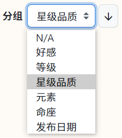
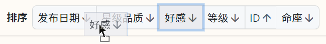
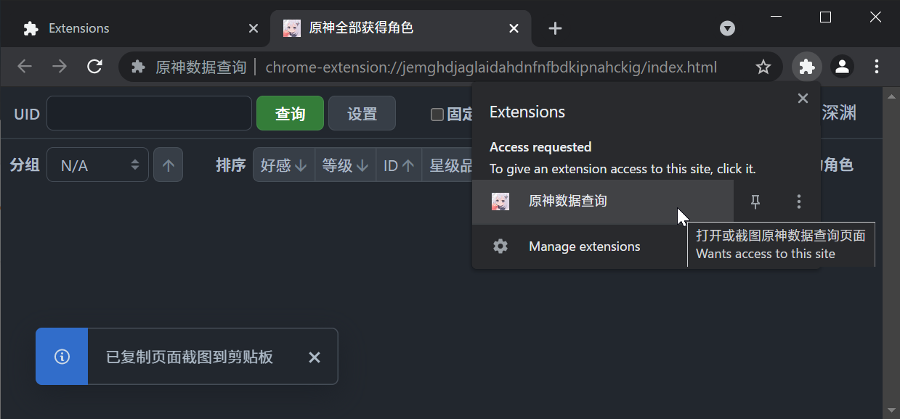
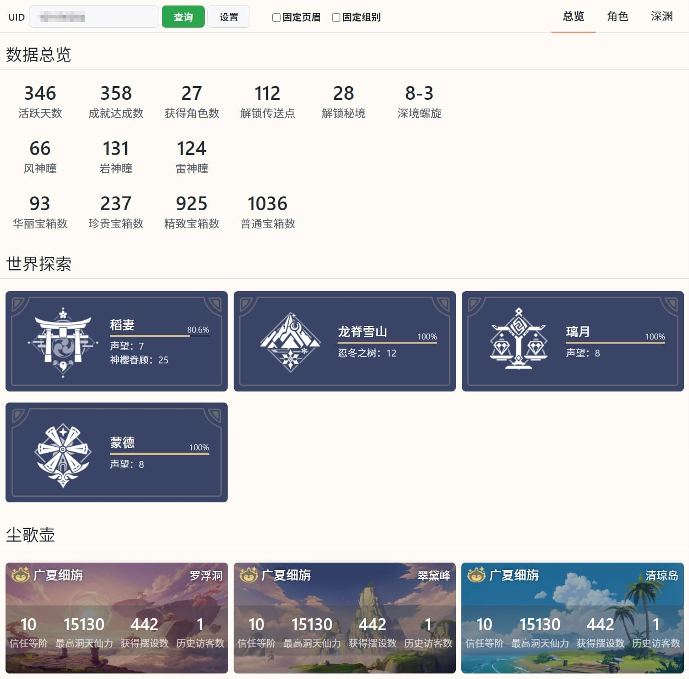
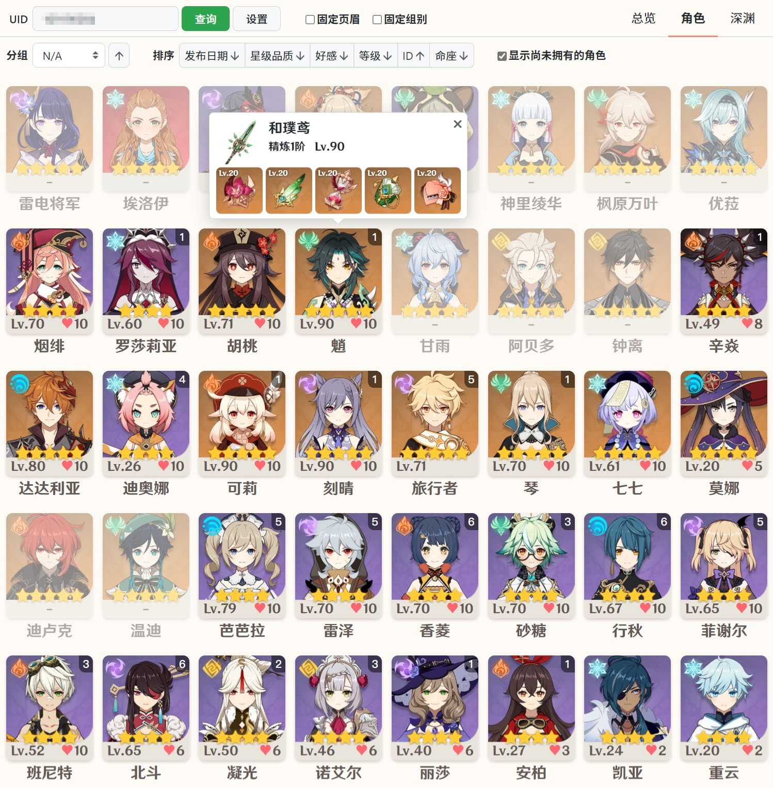
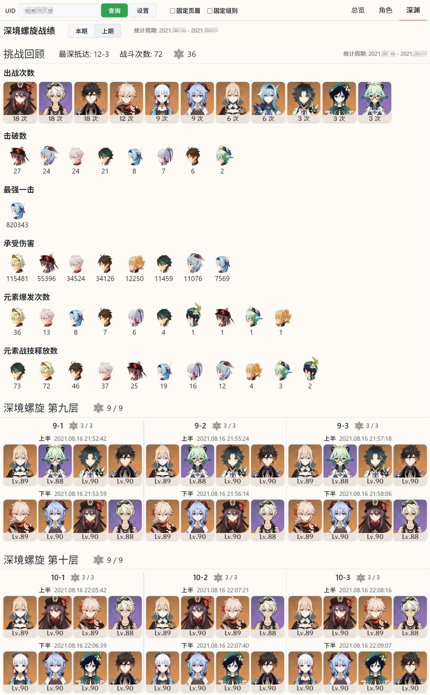

原神数据查询
============
[EN](README.md)
中文

根据 UID 查询原神国服数据，包括角色列表，圣遗物和武器属性，以及深境螺旋记录。使用该扩展无需搭建反向代理，无需下载桌面应用程序。

仅在 Google Chrome 和基于 Chromium 的 Edge 浏览器中测试通过。

源码详见 [packages/genshin-stats](packages/genshin-stats)


## 功能
* 分组  
  

* 多维排序  
  单击按钮切换升序降序，拖拽按钮修改排序优先级。  
  

* 截图  
  该功能仅在浏览器扩展下生效  
  单击浏览器扩展按钮可以快速打开查询页面，在查询页面上再次单击按钮可截图。  
  


## 使用
1. 访问米油社原神社区 [https://bbs.mihoyo.com/ys/](https://bbs.mihoyo.com/ys/)，确保已登录。
2. 打开查询界面: https://genshin-stats.leonis.dev/
3. 在本项目查询页面中输入目标 UID，点击查询按钮即可。

初次使用时请确保已安装 [Tampermonkey](https://www.tampermonkey.net/) 浏览器扩展，
并点击 https://genshin-stats.leonis.dev/genshin-stats.user.js 以将适用于本项目的用户脚本安装至 Tampermonkey。

该脚本仅用于支持“跨域”请求米油社 API，以便工具在无反代的环境下正常工作。
所有数据均存储在浏览器本地，并不会上传或截取您的个人数据，若不放心可自行审计代码。


## 安装为浏览器扩展 (不建议)
下载并解压原神数据查询扩展包，在浏览器扩展页面中打开开发者模式，加载已解压的扩展程序，选择刚才解压的目录即可。

由于字体许可限制，项目中并没有附带原神使用的 汉仪文黑-85W 字体，如需更好的显示效果，请自行从原神目录 `YuanShen_Data/StreamingAssets/MiHoYoSDKRes/HttpServerResources/font` 复制 `zh-cn.ttf` 到 `assets/fonts`，并重命名为 `HYWenHei-85W.ttf`。  
或者从官网等渠道下载字体，并放在前面提到的目录下。也可以右键单击字体，选择「为所有用户安装」，查询页面会自动使用安装在系统中的 汉仪文黑-85W 字体。

如果您是开发者，在加载已解压的扩展程序时，请选择 `dist` 目录（需要事先编译一次）。


## 更新 (浏览器扩展)
直接将新版本的文件覆盖到扩展安装目录即可。


## 编译
``` sh
npm run build:chrome-ext
```


### 截图
总览  
  

角色  
  

角色分组  
  

深境螺旋  
  
